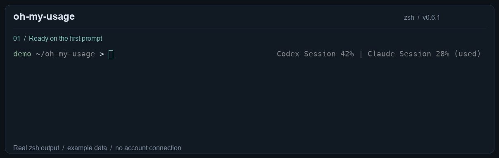
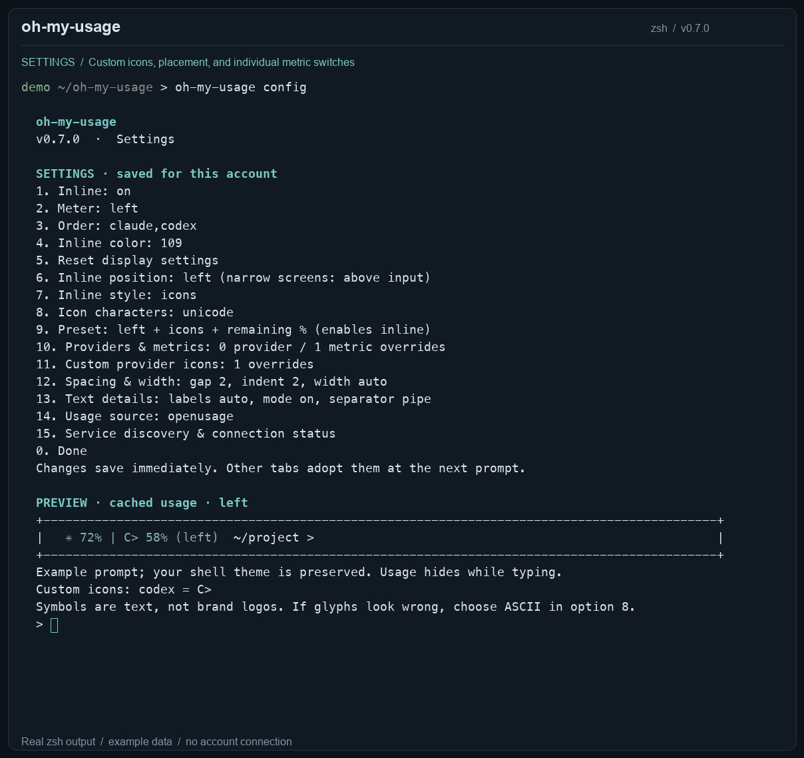

# oh-my-usage · v0.7.1

**[English](README.md) · [简体中文](docs/README.zh-CN.md) · [한국어](docs/README.ko.md)**

Track usage from **11 AI services directly**, in your zsh prompt and the **iTerm2 status bar**. Installed, signed-in clients are discovered automatically; the prompt hint disappears while you type.

**macOS and Linux.** Requires Python 3.9+ and zsh for prompt integration. OpenUsage and Oh My Zsh are optional. The installer creates a private Python environment; `cryptography` supplies Ollama’s Ed25519 signing. The standalone CLI also runs from other shells.

## Demo



Actual zsh output rendered with **sample data**: first-prompt display, hide while typing, then saved meter, order, and color changes. This demo shows the optional inline display; the iTerm2 status bar is configured separately below. [Terminal recording](docs/assets/inline-demo.cast) (replay with `asciinema play docs/assets/inline-demo.cast` from the repository if asciinema is installed).

<details>
<summary>Settings menu — oh-my-usage config</summary>



Choose a number to change a setting. Changes save immediately and apply to future sessions.

</details>

## Install and start with one command

```zsh
git clone https://github.com/wl39/oh-my-usage.git
cd oh-my-usage
./install.sh
```

Run `./install.sh` as your own user, without sudo. On Linux it installs missing Python 3.9+, venv/pip, zsh and system prerequisites through the package manager, requesting sudo only when needed. It creates or repairs the private Python environment, installs dependencies, registers the command, and performs the first service discovery and usage read. **Linux never installs or launches OpenUsage**, including when using `install-full.sh` or `install-existing.sh`.

In an interactive terminal, installation opens a configured zsh immediately: `oh-my-usage` and prompt integration are ready without a new tab, manual `source`, or PATH edits. Run `oh-my-usage providers` to see all 11 connection states. Installed, signed-in clients connect automatically; services requiring API keys still need their keys. Existing display settings are preserved. `exit` returns to the previous shell; use zsh in future terminals (the installer does not change your login shell).

Use `./install.sh --no-start` for unattended setup without the initial usage read or interactive shell. `--no-shell` installs the CLI without prompt integration; run `~/.local/bin/oh-my-usage` from any shell. Non-interactive installation never opens a shell. Re-running `./install.sh` repairs incomplete environments, including **No module named pip**, without deleting saved preferences.

On macOS, missing prerequisites are installed through an existing Homebrew installation. OpenUsage remains optional on macOS. The iTerm2 status bar needs the one-time component setup below; the inline prompt does not.

Help and installation instructions use subtle colors in a terminal. Redirected output stays plain text. Set `NO_COLOR=1` to disable color; `TERM=dumb` is also respected.

## The commands you need

| Command | Result |
| --- | --- |
| `oh-my-usage` | Show help; does not fetch usage |
| `oh-my-usage help` / `oh-my-usage --help` | Show the same help |
| `oh-my-usage start` | Discover signed-in services and refresh the display |
| `oh-my-usage providers --refresh` | List all 11 services and fetch available usage |
| `oh-my-usage history --provider codex` | Read recorded usage snapshots as JSON |
| `oh-my-usage connect openrouter` | Save an API key using hidden input |
| `oh-my-usage config source direct` | Use independent collection (default) |
| `oh-my-usage inline on` | Enable inline display **now and in future sessions** |
| `oh-my-usage inline off` | Disable inline display **now and in future sessions** |
| `oh-my-usage inline on --session` | Enable only in this shell |
| `oh-my-usage inline off --session` | Disable only in this shell |
| `oh-my-usage inline status` | Show the effective setting and where it came from |
| `oh-my-usage config` | Open the settings menu |
| `oh-my-usage doctor` | Diagnose discovery, authentication and usage access |

Run only the command you need; `on` and `off` are alternatives. `oh-my-usage inline --help` shows help for that command.

### Inline: saved once, used across sessions

```zsh
oh-my-usage inline on
```

A new direct installation enables it; an existing saved on/off choice is preserved. Once enabled, new tabs and later SSH sessions into the **same account** use it automatically. Already-open tabs pick up a changed setting at their next prompt. A `--session` override stays local to that shell and leaves the saved preference untouched. Running `inline on/off` without the flag clears the current shell's temporary override and saves the new choice.

- The first prompt displays cached data immediately; if no cache exists, it redraws as soon as the read finishes. No Enter is needed.
- Display appears only when input is completely empty, in muted gray (`245`) by default.
- Typing, spaces, paste, history recall, and multiline continuations hide it. Clearing input restores it.
- On screens at least 80 columns wide it appears beside the right prompt by default; choose `position left` to put it before your left prompt. Narrower screens show it above the input line in either mode. Long text ends in `…`.
- The iTerm2 status bar remains visible while typing.

The setting is a tiny data file at `~/.config/oh-my-usage/inline`, not an edit to `.zshrc`. Priority: **`--session` → saved choice → `OH_MY_USAGE_INLINE` → off**. Saved choices also take precedence over old `export OH_MY_USAGE_INLINE=...` lines from v0.4.

### Settings menu: position, icons, meter, order, and color

```zsh
oh-my-usage config
```

Choose a number, then a value. Each change saves immediately; Enter cancels a choice, and `0` exits. The menu includes inline on/off, **used / left**, **Claude → Codex / Codex → Claude**, custom provider order, and muted color presets or a 256-color index.

**Choose `9` for left + icons + remaining %.** This also enables inline display. For example, with one starred metric per provider:

```text
✳ 72% | ◇ 58% (left) ~/project >
```

The settings menu and `config show` include a preview of the current position, style, meter, order, and color. It uses cached usage, or clearly labeled sample data when no usable snapshot/settings exist. The prompt in the preview is an example; your actual shell theme is preserved. The preview never requests usage from the API.

Icons are Unicode text symbols (`✳` Claude, `◇` Codex), not image logos, and need no image protocol or Nerd Font mapping. Rendering depends on your terminal font; option `8` offers plain ASCII labels (`CL`, `CX`) if symbols are missing or misaligned. Unknown providers keep their names. Multiple starred periods use `S` (Session) and `W` (Weekly), for example `◇ S:58%/W:90%`. Metrics with limits become percentages; balance/text metrics keep their original units.

Fine controls are available in the same menu:

| Option | Controls |
| --- | --- |
| `6` | Before the left prompt, after it, above it, right, or automatic |
| `10` | Provider and individual metric switches: on / off / source default |
| `11` | A custom symbol or short label per provider; `none` hides it, `auto` restores it |
| `12` | Prompt gap (0–8 spaces), left/above indentation (0–20), maximum usage width (1–240 or auto) |
| `13` | Metric labels, the used/left label, and pipe/dot/space separators |
| `14` | Direct or optional OpenUsage source |
| `15` | All-service discovery and connection status |

Each editor shows the updated preview. Turning a metric on can include an unstarred metric available in the cache; its provider must also be on. Explicit choices can show more than two metrics. Hiding every selected item removes the inline hint. Missing data is never converted to zero. These switches affect inline display only; OpenUsage and status-bar selections stay intact. Preset `9` preserves these detailed choices; reset `5` clears them.

```zsh
oh-my-usage config icon claude '✦'
oh-my-usage config icon codex 'C>'
oh-my-usage config provider claude off
oh-my-usage config metric codex.session on
oh-my-usage config metric codex.weekly off
oh-my-usage config position above
oh-my-usage config indent 2
oh-my-usage config gap 2
oh-my-usage config width 48
oh-my-usage config metric-labels off
oh-my-usage config mode-label off
oh-my-usage config separator space
```

Custom icons support 1–12 printable characters and override the Unicode/ASCII choice in icon style. The icon editor enables icon style automatically; from the CLI use `config style icons`. Use `config icon codex auto`, `config provider claude auto`, or `config metric codex.weekly auto` to reset just one choice. No usage is fetched solely to populate the editors. `config show` also lists individual saved overrides.

You can also set a single option directly:

```zsh
oh-my-usage config mode left
oh-my-usage config order claude,codex
oh-my-usage config color cyan
oh-my-usage config position left
oh-my-usage config style icons
oh-my-usage config icons unicode
```

- `mode used` shows consumption; `mode left` shows remaining allowance. `mode auto` uses the source default (used in direct mode).
- `order claude,codex` puts Claude first and Codex second. Other enabled providers follow; this does not enable providers or change selected metrics. `order auto` uses discovery order in direct mode.
- `color` accepts `gray`, `cyan`, `green`, `blue`, `purple`, `yellow`, `red`, `white`, or `0`–`255`. Saved colors override `OH_MY_USAGE_INLINE_COLOR`; `color auto` restores the environment/default color.
- `position left/after/above/right/auto` selects inline placement; `auto` keeps the original right-side layout. All positions move above the input on screens narrower than 80 columns. Saved `width` takes precedence over `OH_MY_USAGE_INLINE_WIDTH` and is capped to available space.
- `style text/icons` chooses full names or compact icons. `icons unicode/ascii` chooses symbols or font-independent labels. Defaults are `text` and `unicode`.
- **Color applies to inline text.** For the iTerm2 status bar, set the text color in the Interpolated String component's configuration. Meter and order apply to both displays.
- Position, style, and icon characters apply only to inline display; the iTerm2 status bar keeps its full text.
- `config show` lists choices with a preview. `config reset` resets all display preferences; inline on/off stays unchanged.

Preferences are small files (`inline`, `mode`, `order`, `color`, `position`, `style`, `icons`, `gap`, `indent`, `width`, `metric-labels`, `mode-label`, `separator`, plus the JSON maps `icon-map`, `providers`, `metrics`) in `~/.config/oh-my-usage` (or your configured directory). They persist across new tabs, SSH sessions, and updates without changing OpenUsage's own settings. Other open tabs adopt changes at their next prompt. An inline `--session` override still takes priority in its shell. A fresh cached snapshot can be reformatted without another API request.

### iTerm2 status bar: one-time setup

1. **Settings → Profiles → your profile → Session**: enable **Status bar enabled**.
2. **Configure Status Bar**: add **Interpolated String** beside your existing components.
3. **Configure Component → String Value**: paste:

```text
\(user.oh_my_usage)
```

Then use `oh-my-usage start`. Existing profiles/layouts are preserved. This is an iTerm2 built-in component, not a separate widget. [Official iTerm2 guide](https://iterm2.com/documentation-status-bar.html).

### SSH / Termius / iPhone

SSH into the macOS or Linux account where the clients are installed and signed in, use zsh, and enable inline display. Usage is collected on that host. API forwarding and iTerm2 on your phone are unnecessary. Credentials and usage do not automatically transfer between machines. Prompt integration uses zsh; the CLI works from other shells.

## Update to v0.7.1

From your cloned repository:

```zsh
git pull --ff-only
./install.sh
```

In an interactive terminal the installer refreshes usage and opens a ready zsh. Reuse any custom `--prefix` or `--no-shell` option from your original install.

**v0.7.1:** repairs incomplete installs, handles unrelated APT repository failures, checks real signing functionality, follows `.zshenv` configuration paths, and reports permission/network failures by stage. [Installation diagnostics (한국어)](docs/installation.md).

**New in v0.7.0:** independent adapters for all 11 services, automatic connection discovery, Linux installation, per-service cooldowns, and 30-day snapshot history. `./install.sh` selects direct collection; use `./install-existing.sh` to retain the optional OpenUsage backend.

## Supported services and automatic connection

Antigravity, Claude, Codex, GitHub Copilot, Cursor, Devin, Grok, Ollama, OpenCode, OpenRouter, and Z.ai are implemented. Native clients supply authentication; key-only services use their environment variables or `connect`. See [provider setup, metrics and limitations](docs/providers.md) for the full matrix.

Discovery runs at prompt refresh boundaries (30 seconds by default); successful services are fetched at most once every 5 minutes. A newly detected credential bypasses its previous cooldown. `refresh` forces collection except during a server-requested rate-limit wait. No polling occurs while the shell is idle or running another command. To collect from a headless job, invoke the CLI on your own schedule.

Successful usage snapshots are retained for 30 days. `history --provider ID --days 7` prints the current credential's snapshots as JSON, including units and reset times. It starts at installation; it is not a reconstruction of past token spending. The cache excludes tokens, account names and conversation text. Signed-in clients own token renewal; a rejected/expired login is shown with a reauthentication status. OpenUsage's extra cost estimators and UI are not reproduced.

## Troubleshooting

Start with `oh-my-usage doctor`.

| Symptom | Fix |
| --- | --- |
| `command not found` | Run `zsh` or `~/.local/bin/oh-my-usage`; with `--no-shell`, load the plugin for prompt integration |
| APT reports a third-party repository has no Release file | Update the clone and rerun `./install.sh`. It tries installing prerequisites from available indexes without changing repository settings or bypassing verification; actual package installation must still succeed. |
| `No module named pip` during installation | Pull the latest code and rerun `./install.sh`; the private environment is repaired automatically |
| Empty status bar | Check the profile and exact `\(user.oh_my_usage)` value, then run `start` |
| No inline hint | Run `inline status`, then `inline on`; clear input. A very long theme may leave no right-prompt space |
| `[offline]` | A cached read is shown; run `providers --refresh` / `doctor` to inspect failures |
| Provider name ends in `~` | A refresh failed, or the snapshot is over 10 minutes old |
| `no connected services` | Run `providers`; sign in to a native client or configure a required API key |
| `no pinned data` (OpenUsage mode) | Enable providers and star metrics in OpenUsage |
| `menuBarPins` / settings error | Use this version; toggle a star in Customize, reopen OpenUsage, and run `refresh` |

In optional OpenUsage mode, a missing `menuBarPins` key uses OpenUsage's default stars; an explicitly empty list stays empty. `OH_MY_USAGE_DISPLAY=off` disables both displays; `start` re-enables integration in the current shell.

## Advanced options

<details>
<summary>Installation modes, configuration, scripts, and Oh My Zsh</summary>

The default `./install.sh` works independently on macOS/Linux. The original macOS-only modes remain available: `./install-full.sh` installs OpenUsage if missing; `./install-existing.sh` requires an existing app. Both install to `~/.local/share/oh-my-usage`, back up shell configuration, and register the plugin in `~/.zshrc` or `$ZDOTDIR/.zshrc`. The wrappers also use direct mode on Linux. Do not prefix the installer with `sudo`; it requests privilege only for missing system packages. Use `--prefix /your/install/path` for a custom directory, or `--no-shell` for manual plugin management.

Optional environment variables, placed before the plugin loads:

| Variable | Default / purpose |
| --- | --- |
| `OH_MY_USAGE_INLINE` | `off`; fallback when no saved choice exists |
| `OH_MY_USAGE_INLINE_COLOR` | `245`; 256-color index, 0–255; brightness depends on your palette |
| `OH_MY_USAGE_INLINE_WIDTH` | Automatic; maximum hint width, capped to screen space |
| `OH_MY_USAGE_DISPLAY` | `status`; `off` disables both displays |
| `OH_MY_USAGE_INTERVAL` | `30`; cache lifetime in seconds, minimum 5 |
| `OH_MY_USAGE_CONFIG_DIR` | `$XDG_CONFIG_HOME/oh-my-usage`, or `~/.config/oh-my-usage` |
| `OH_MY_USAGE_CACHE_DIR` | macOS: `~/Library/Caches/oh-my-usage`; Linux: `$XDG_CACHE_HOME/oh-my-usage` or `~/.cache/oh-my-usage` |
| `OH_MY_USAGE_SOURCE` | `direct` or `openusage`; overrides the saved source |
| `OH_MY_USAGE_PYTHON` | Python used to create the private environment; installed commands prefer their recorded runtime |
| `OH_MY_USAGE_PREFERENCES` | Optional OpenUsage plist file |
| `OH_MY_USAGE_APP_DIR` | Folder containing OpenUsage.app, for installation and `start` |

Use absolute paths or `$HOME` in path overrides. Open a new tab after changing the configuration directory.

`show` prints usage using the cache, `refresh` forces a new read, `cached` prints the last display, and `--version` prints the version. `oh-my-usage-unload` removes the current shell's hooks. For scripts, use `~/.local/share/oh-my-usage/bin/oh-my-usage`; `inline on/off` also saves settings through this executable. `--session` requires the loaded interactive zsh function.

To manage the plugin via Oh My Zsh instead of the normal source block, use `--no-shell` on the first install, then:

```zsh
mkdir -p "${ZSH_CUSTOM:-$HOME/.oh-my-zsh/custom}/plugins"
ln -s "$HOME/.local/share/oh-my-usage" \
  "${ZSH_CUSTOM:-$HOME/.oh-my-zsh/custom}/plugins/oh-my-usage"
```

Add `oh-my-usage` to your existing `plugins=(...)` list. Put environment settings before the Oh My Zsh source line. Choose one loading method; `--no-shell` does not remove an earlier source block.

</details>

<details>
<summary>Migration from OUIterm and uninstall</summary>

If the old OUIterm installation still exists, remove it from the new clone with `./install.sh uninstall --prefix "$HOME/.local/share/ouiterm"` (use the old custom path if applicable). Remove manually added `ouiterm` plugin entries/symlinks, rename `OUITERM_*` variables to `OH_MY_USAGE_*`, and replace `\(user.ouiterm)` with `\(user.oh_my_usage)`. Then install and open a new tab.

To uninstall:

```zsh
~/.local/share/oh-my-usage/install.sh uninstall
```

Installed files, the marked shell block, and display cache files are removed. The direct snapshot history and saved credentials/preferences are retained for reinstallation; remove the dedicated `direct` cache directory and `credentials.json` yourself to erase them. OpenUsage, Python, other status bar components, backups, and saved preferences are kept. Close old shells or run `oh-my-usage-unload`; remove the Interpolated String and any manually added Oh My Zsh entry/symlink. For a custom install, use its `install.sh uninstall`.

Display reset preserves the saved source and API keys. To erase them too, remove the `source`, `inline`, and `credentials.json` files from your configuration directory after uninstalling.

</details>

## Lightweight design and development

The collector is Python + zsh, with `cryptography` used only for Ollama request signing. It is a one-shot process, with no extra daemon. Tabs share a private cache and file lock; keypress handling uses zsh builtins. Network failures are isolated per provider; timeouts, bounded responses and backoff avoid prompt blocking. The native stores are read without modification, and macOS keychain lookups disable access dialogs and run in a bounded helper process.

The `direct` backend never calls or reads OpenUsage. Optional `openusage` mode retains the loopback API and upstream display preferences for compatibility. Direct metrics default to the first two available meters per service; settings allow more explicit choices.

Run `python3 -m pip install -r requirements.txt` in a development environment, then `./scripts/check.sh`. Tests cover all 11 response contracts, native-store discovery, signed requests, source switching, failure isolation, history and real zsh pseudo-terminals. CI runs on macOS and Linux, with separate pristine Ubuntu 22.04/24.04 installation tests (missing prerequisites, pip recovery and immediate shell use). The provider protocols are partly private and can change; see [sources and support scope](docs/providers.md). The MIT notice for referenced OpenUsage protocol/format code is included under `oh_my_usage/providers/third_party` and shipped by the installer.

README media can be regenerated on macOS with `scripts/record_demo.py`; its docstring lists the optional development dependencies. It uses an isolated zsh session with sample data. The media generator and assets are excluded from installation.

[MIT license](LICENSE). Independent of the OpenUsage, iTerm2, and Oh My Zsh projects.
